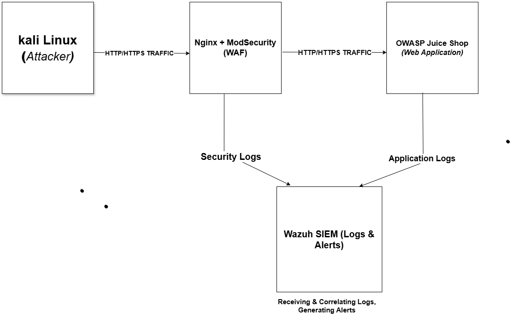

# WAF Architecture

This diagram represents the architecture of the Web Application Firewall (WAF) lab.

## Components

- **External Client / Attacker (Kali Linux)**
  - Generates normal and malicious HTTP/HTTPS traffic

- **WAF (Nginx + ModSecurity with OWASP CRS)**
  - Acts as a reverse proxy
  - Inspects incoming requests
  - Blocks or allows traffic based on security rules
  - Generates security audit logs

- **Vulnerable Web Application (OWASP Juice Shop)**
  - Target application used to simulate attacks
  - Generates application-level logs

- **Wazuh SIEM**
  - Collects logs from WAF and application
  - Correlates events
  - Generates security alerts

## Architecture Diagram

